# TrustMesh

**Decentralized business trust & reputation on Stellar Soroban.**

TrustMesh is trust infrastructure for businesses, startups, agencies, freelancers, vendors, and service providers — not crowdfunding, not escrow, not NFTs, not a DAO, not CRM, and not a social network.

Organizations establish **verifiable trust** through completed relationships, verified reviews, dispute history, reputation scores, and an immutable on-chain event trail.

**Green Belt MVP** on the existing Orange Belt contracts. Six cooperating Soroban programs, live Testnet deployment, and an empty-ledger honesty policy stay in place. Green Belt work is onboarding, a complete trust workflow, real analytics/monitoring, and production UX.

Green Belt docs: [`docs/GREEN_BELT_CHECKLIST.md`](./docs/GREEN_BELT_CHECKLIST.md) · [`docs/GREEN_BELT_EVIDENCE.md`](./docs/GREEN_BELT_EVIDENCE.md) · [`docs/evidence/`](./docs/evidence/)

[](https://trust-mesh-taupe.vercel.app)
[](https://stellar.expert/explorer/testnet)
[](./contracts)
[](https://github.com/nishant-uxs/TrustMesh/actions/workflows/ci.yml)
[](./LICENSE)

---

## Problem

Business trust still lives in PDFs, screenshots, and platforms that own the data. Relationship history, review verification, and dispute outcomes are hard for a counterparty to audit independently.

## Solution

A Stellar Testnet console where a wallet registers an organization, an admin verifies it, parties create and complete a trust relationship through the factory, reviewers submit scored feedback, and reputation updates on-chain — with a public activity trail and explorer-linked receipts.

## Target users

| Role | First meaningful action |
|---|---|
| Business / buyer | Register an organization, then start a relationship |
| Freelancer / agency | Complete work on-chain and collect a verified review |
| Supplier / vendor | Get listed under an org and build a public score |
| Platform admin | Verify organizations and reviews (auth-gated) |
| Observer | Read the public ledger / activity without inventing data |

---

## Why TrustMesh stands out

| Capability | TrustMesh |
|---|---|
| Contract surface | **Six** single-responsibility Soroban contracts |
| Factory orchestration | Verified orgs → create relationship → track reputation → record fee in one flow |
| Reputation | Scores from completions, verified reviews, and dispute outcomes |
| Treasury | Fee config + deposits; optional SAC custody for token pulls / skim |
| Console honesty | **Empty-by-default** — no fake seed balances or invented charts |
| Wallet UX | Picker every connect (**Freighter / xBull / LOBSTR / Albedo / Hana / Rabet**) |
| Signing | Simulate → assemble → wallet-sign → submit for register / relationships / reviews |
| Transparency | Explorer-linked contract IDs + activity from RPC `getEvents` |
| Auth boundaries | Factory-gated create · admin verify · owner-only accept/complete/submit |

---

## Live demo & submission

| | Link |
|---|---|
| **Live app (Vercel)** | https://trust-mesh-taupe.vercel.app/ |
| **Demo video** (Orange Belt walkthrough) | https://drive.google.com/file/d/1GWH_qCdsZ1c9zzUfPgUF_nY-hmoOfmzN/view?usp=sharing |
| **GitHub** | https://github.com/nishant-uxs/TrustMesh |
| **Green CI/CD run** | https://github.com/nishant-uxs/TrustMesh/actions/runs/30162067608 |
| **Organization Registry** | [`CD6AAYZ7…NRZT`](https://stellar.expert/explorer/testnet/contract/CD6AAYZ7IVW6SQDP6NRKRZ3QIRQQPB3ZDRKTSA7ZBU2VRWN4VM4ZNRZT) |
| **Reputation** | [`CDYSM4LG…RBL5`](https://stellar.expert/explorer/testnet/contract/CDYSM4LG4OUPSXGDDSJMZK7H532223GNBAF6I5RAYAFG74HD5QRPRBL5) |
| **Treasury** | [`CA63C3PL…MONH`](https://stellar.expert/explorer/testnet/contract/CA63C3PLR2GQRNLES6JO72YPFO6HWUYLVWFPZBNY47BRZPYSPUGWMONH) |
| **Trust Relationship** | [`CBCTIWGK…LDXJ`](https://stellar.expert/explorer/testnet/contract/CBCTIWGKIIGMDMJNPGT4OLVITGTVTW3JFTMHKYBOT42ENZZWEITJLDXJ) |
| **Trust Relationship Factory** | [`CBF5KOXX…JGHK`](https://stellar.expert/explorer/testnet/contract/CBF5KOXX34HEF3Q6ECLWQY543V53HJRJ25W5X3DO6O2XII4GP2FHJGHK) |
| **Review Verification** | [`CBXOCI2B…J3KF`](https://stellar.expert/explorer/testnet/contract/CBXOCI2BQTCDUJOVJCAC7TQLBA5HNGVU7UQ5JDLJF44ZHOZBG4PLJ3KF) |
| **First deploy tx** | [`384cb67c…fcd0`](https://stellar.expert/explorer/testnet/tx/384cb67cad2cdcc4c27dc50bb445aed03da1c7619e0d3cec78ac78f80ba7fcd0) |
| **Sample register tx** | [`fa96bc2e…0a24`](https://stellar.expert/explorer/testnet/tx/fa96bc2eefc492914cfd0641a667fb0df03b0be12ba3c3a97e67dcd5cd960a24) |
| **10+ unique Testnet wallets** | [`docs/evidence/WALLET_INTERACTIONS.md`](./docs/evidence/WALLET_INTERACTIONS.md) |
| **E2E trust lifecycle** | [`docs/evidence/DEMO_ACTIVITY.md`](./docs/evidence/DEMO_ACTIVITY.md) |
| **Feedback summary** | [`docs/evidence/FEEDBACK_SUMMARY.md`](./docs/evidence/FEEDBACK_SUMMARY.md) |

> Live IDs also live in [`deployments/testnet.json`](./deployments/testnet.json) and [`frontend/public/contracts.json`](./frontend/public/contracts.json).

Those wallet rows are **Testnet demo identities** with signed contract calls — **not organic users**. Secrets are not in git.

### Screenshots

<p align="center">
  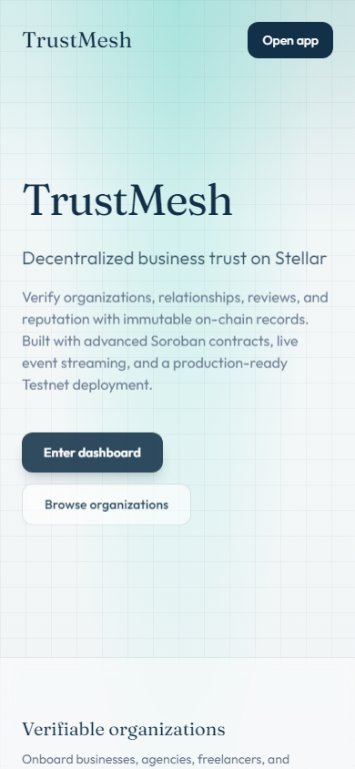
  &nbsp;&nbsp;
  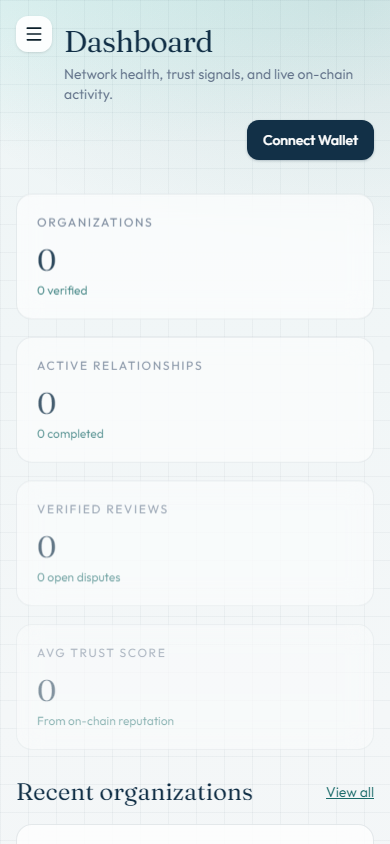
</p>
<p align="center"><em>Mobile-responsive landing + dashboard (390×844)</em></p>

<p align="center">
  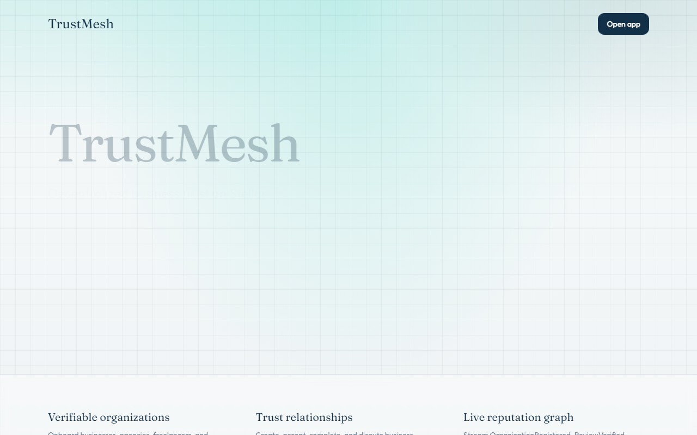
</p>
<p align="center"><em>Desktop landing</em></p>

<p align="center">
  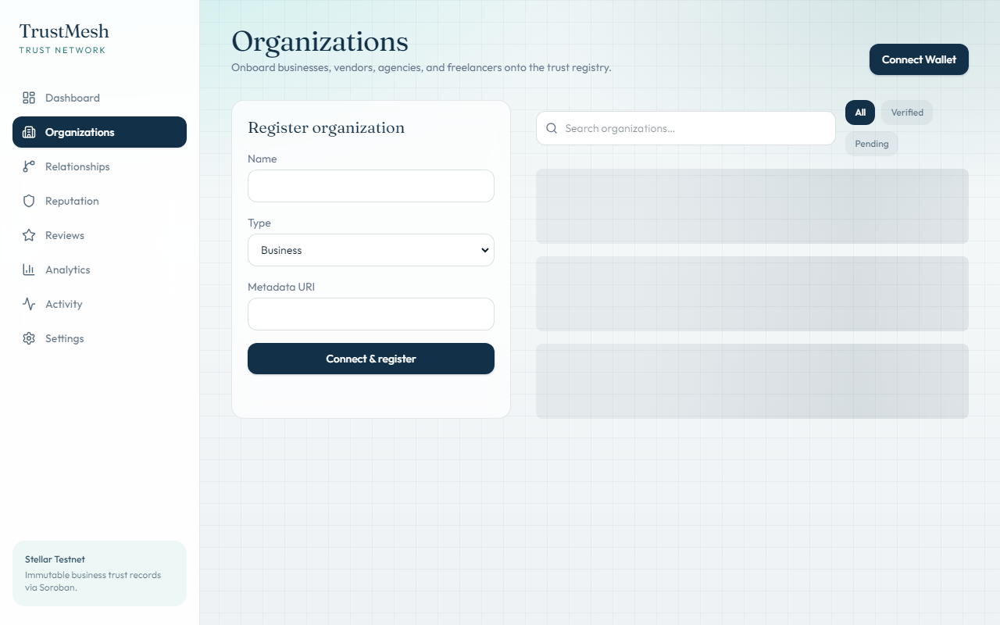
</p>
<p align="center"><em>Organizations — search, filters, on-chain register</em></p>

<p align="center">
  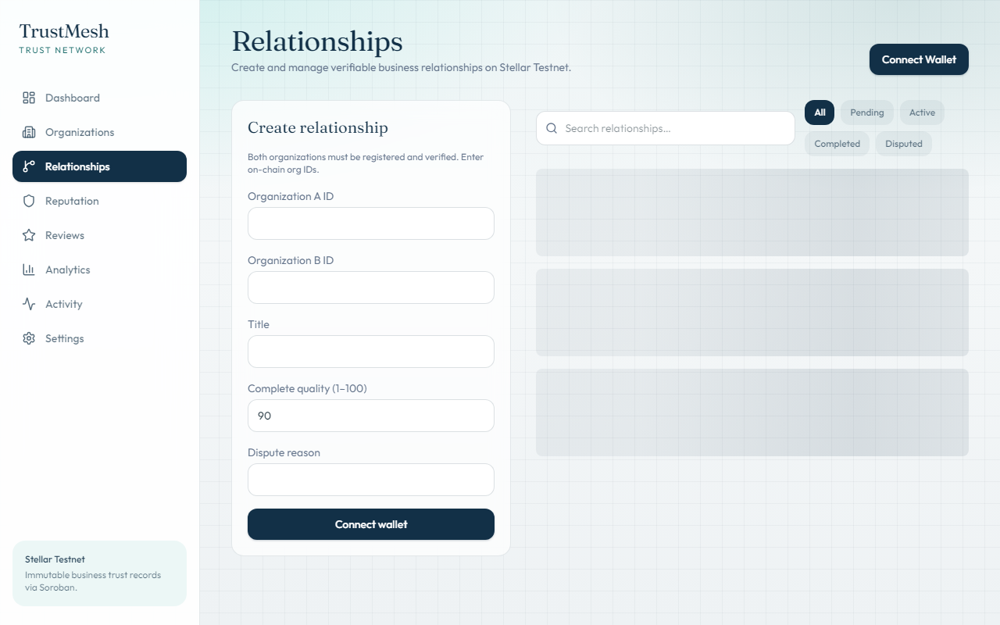
</p>
<p align="center"><em>Relationships — accept / complete + confirm dialogs</em></p>

<p align="center">
  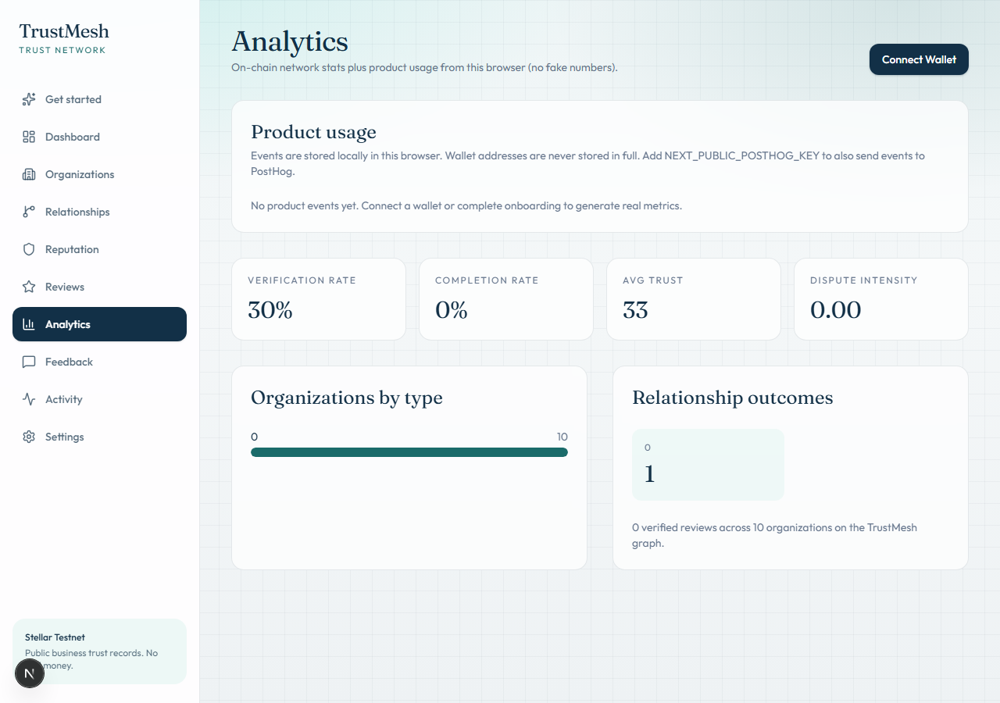
</p>
<p align="center"><em>Analytics — live Testnet org/relationship counts; product events stay empty until this browser records them</em></p>

<p align="center">
  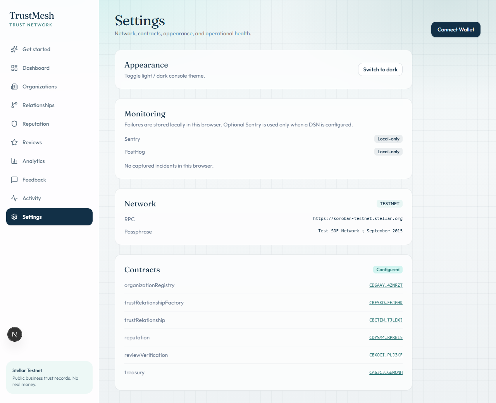
</p>
<p align="center"><em>Monitoring — PostHog / Sentry stay local-only unless env keys are set</em></p>

<p align="center">
  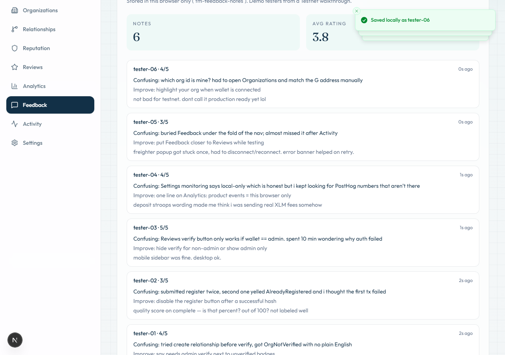
</p>
<p align="center"><em>Feedback — demo-tester notes in this browser (see docs/evidence/FEEDBACK_SUMMARY.md)</em></p>

<p align="center">
  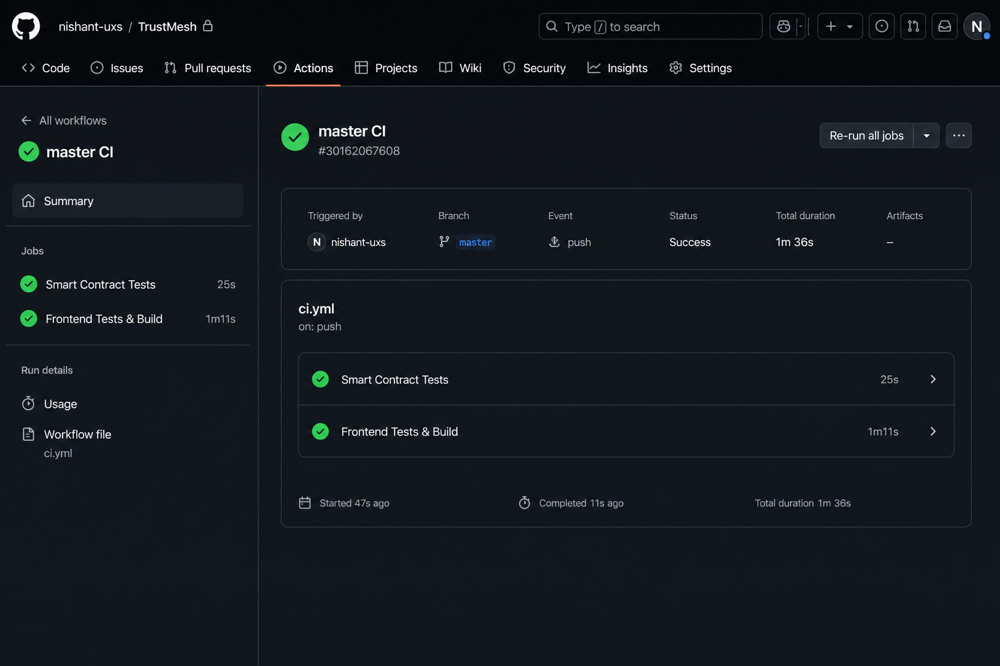
</p>
<p align="center"><em>CI/CD — Contracts (test + WASM) → Frontend (lint / typecheck / test / build) → Deploy gate</em></p>

More screenshots: [`docs/screenshots/`](./docs/screenshots/)

**Test output:** 39 smart-contract tests (`cargo test --workspace`) plus frontend Vitest. See CI.

---

## System architecture

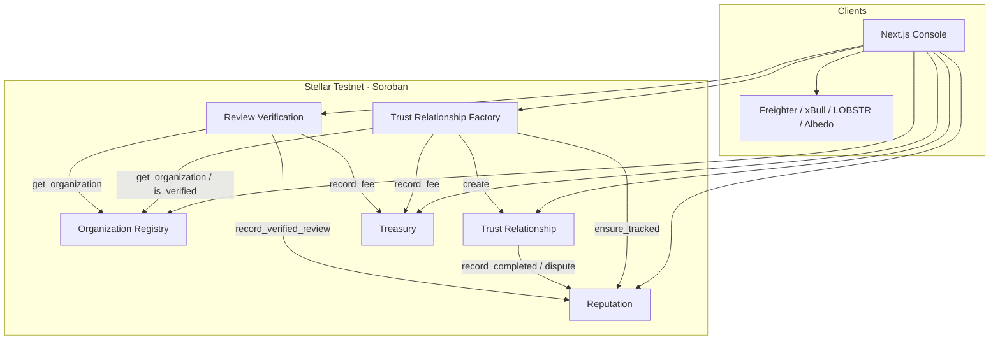

### Trust lifecycle

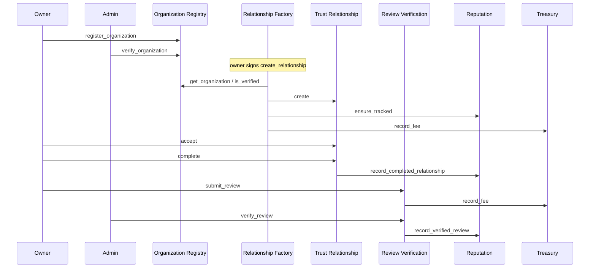

### Authorization model

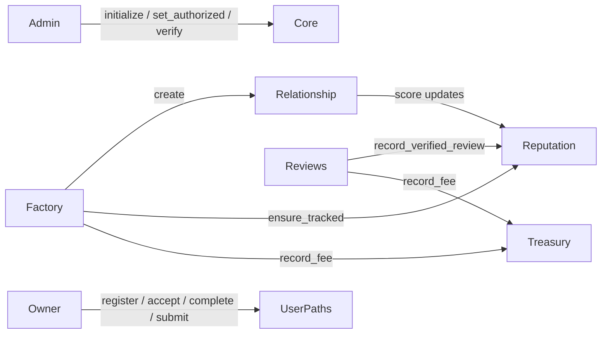

---

## Smart contracts

| Contract | ID (testnet) | Role |
|---|---|---|
| Organization Registry | [`CD6AAYZ7…NRZT`](https://stellar.expert/explorer/testnet/contract/CD6AAYZ7IVW6SQDP6NRKRZ3QIRQQPB3ZDRKTSA7ZBU2VRWN4VM4ZNRZT) | Register / verify orgs + vendors |
| Reputation | [`CDYSM4LG…RBL5`](https://stellar.expert/explorer/testnet/contract/CDYSM4LG4OUPSXGDDSJMZK7H532223GNBAF6I5RAYAFG74HD5QRPRBL5) | Trust scores from reviews & completions |
| Treasury | [`CA63C3PL…MONH`](https://stellar.expert/explorer/testnet/contract/CA63C3PLR2GQRNLES6JO72YPFO6HWUYLVWFPZBNY47BRZPYSPUGWMONH) | Fee config, deposits, fee accounting |
| Trust Relationship | [`CBCTIWGK…LDXJ`](https://stellar.expert/explorer/testnet/contract/CBCTIWGKIIGMDMJNPGT4OLVITGTVTW3JFTMHKYBOT42ENZZWEITJLDXJ) | Lifecycle, disputes, completion |
| Trust Relationship Factory | [`CBF5KOXX…JGHK`](https://stellar.expert/explorer/testnet/contract/CBF5KOXX34HEF3Q6ECLWQY543V53HJRJ25W5X3DO6O2XII4GP2FHJGHK) | Cross-contract relationship orchestration |
| Review Verification | [`CBXOCI2B…J3KF`](https://stellar.expert/explorer/testnet/contract/CBXOCI2BQTCDUJOVJCAC7TQLBA5HNGVU7UQ5JDLJF44ZHOZBG4PLJ3KF) | Submit / verify / reject reviews |

Full IDs: [`deployments/testnet.json`](./deployments/testnet.json)

### Events emitted

`OrganizationRegistered` · `OrganizationVerified` · `RelationshipCreated` · `RelationshipCompleted` · `ReviewSubmitted` · `ReviewVerified` · `ReputationUpdated` · `TrustScoreUpdated` · `DisputeOpened` · `DisputeResolved` · `TreasuryDeposit`

---

## Repository layout

```
TrustMesh/
├── contracts/                 # 6 Soroban crates + tests
├── frontend/                  # Next.js 15 · TypeScript · Tailwind
├── scripts/                   # deploy, demo-users, demo-activity
├── deployments/testnet.json   # Live addresses + deploy tx
├── docs/                      # Architecture, Green Belt, evidence, screenshots
├── .github/workflows/ci.yml
├── Makefile
└── README.md
```

### CI/CD pipeline

Every push / PR on `master` runs a gated pipeline:

1. **Contracts** — `cargo test --workspace` → WASM build (6 crates) → validate `deployments/testnet.json`
2. **Frontend** — `npm ci` → lint → **typecheck** → test → production build
3. **Deploy gate** — confirms Vercel production path after both jobs pass

CI: [`.github/workflows/ci.yml`](./.github/workflows/ci.yml)  
**Latest green run:** https://github.com/nishant-uxs/TrustMesh/actions/runs/30162067608

---

## Quick start

### Prerequisites

- Rust stable + `wasm32v1-none`
- [Stellar CLI](https://developers.stellar.org/docs/tools/cli) v25+
- Node.js 20+
- Freighter (or another supported wallet)

### One-liners

```bash
make test           # contracts + frontend
make frontend-dev   # http://localhost:3000
make deploy         # testnet (funded deployer key)
```

### Contracts

```bash
cargo test --workspace
stellar contract build

# Windows
.\scripts\deploy.ps1 -Source deployer -Network testnet
# macOS / Linux
bash scripts/deploy.sh --source deployer --network testnet
```

### Frontend

```bash
cd frontend
cp ../deployments/testnet.env .env.local
# optional ops keys — see frontend/.env.example
npm install
npm run dev
```

Open http://localhost:3000 then `/onboarding` for first-run roles.

### Demo evidence scripts (optional)

```bash
node scripts/demo-users.mjs --count 10
node scripts/demo-activity.mjs
```

---

## User flow

1. Connect a Stellar wallet (picker every time)
2. Choose a role and create a profile (`/onboarding`)
3. Register an organization (`/organizations`); admin verifies it
4. Create a relationship (`/relationships`) — factory checks both orgs are verified
5. Both parties **accept**, then **complete** (quality score)
6. Submit a review (`/reviews`); admin can verify
7. Reputation + analytics + activity update from the live ledger (empty until data exists)

This product has no separate milestone / escrow-release methods; **accept → complete** is the lifecycle.

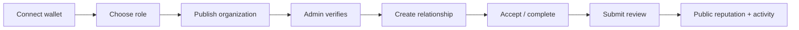

---

## Frontend quality bar

Pages: Landing · Get started · Dashboard · Organizations · Relationships · Reputation · Reviews · Analytics · Feedback · Activity · Public Profile · Settings

- Wallet choice modal on every connect (Freighter / xBull / LOBSTR / Albedo / Hana / Rabet)
- Transaction panels: simulating → signing → submitted → confirmed / failed + explorer link
- Human-language copy for each approval; Friendbot recovery when the account is unfunded
- Skeletons, empty states, confirm dialogs, toasts
- Search / filters / pagination
- Charts stay empty until RPC returns orgs/relationships; product analytics stay at zero until real events
- Full signed flows: org register, factory create, accept/complete, submit/verify review
- Production invoke path: simulate → assemble → sign → submit
- Light / dark theme · responsive desktop / tablet / mobile

---

## Environment variables

The app runs without remote ops tools. Optional keys live in `frontend/.env.local` (see `frontend/.env.example`):

| Variable | Required | Purpose |
|---|---|---|
| `NEXT_PUBLIC_*_ID` contract IDs | Yes (from `deployments/testnet.env`) | Live Testnet contracts |
| `NEXT_PUBLIC_ADMIN_ADDRESS` | No | UI gates for admin-only actions |
| `NEXT_PUBLIC_POSTHOG_KEY` | No | Product analytics (also stored locally) |
| `NEXT_PUBLIC_POSTHOG_HOST` | No | PostHog host |
| `NEXT_PUBLIC_SENTRY_DSN` | No | Error monitoring (also stored locally) |

Never put seed phrases or deployer secrets in frontend env.

---

## Analytics & monitoring

- **Analytics:** local product events (Analytics page). Optional PostHog. Docs: [`docs/ANALYTICS.md`](./docs/ANALYTICS.md)
- **Monitoring:** local incident log (Settings). Optional Sentry. Docs: [`docs/MONITORING.md`](./docs/MONITORING.md)

Neither integration runs unless the env var is set. No secrets belong in git.

---

## Testing

```bash
# 39 smart-contract tests
cargo test --workspace

# Frontend
cd frontend
npm run lint
npm run typecheck
npm test
npm run build
```

---

## Demo video

**Watch (Orange Belt recording):** https://drive.google.com/file/d/1GWH_qCdsZ1c9zzUfPgUF_nY-hmoOfmzN/view?usp=sharing

Recording script: [`docs/DEMO_VIDEO.md`](./docs/DEMO_VIDEO.md)

Suggested 90s flow: landing → Get started → connect wallet → Friendbot (optional) → choose role → publish organization (sign) → public receipt → start a relationship.

Filled Green Belt artifacts: [`docs/evidence/`](./docs/evidence/) · template: [`docs/GREEN_BELT_EVIDENCE.md`](./docs/GREEN_BELT_EVIDENCE.md)

---

## Green Belt checklist

Mapped requirement → implementation: [`docs/GREEN_BELT_CHECKLIST.md`](./docs/GREEN_BELT_CHECKLIST.md)

- [x] Production MVP workflow on Testnet
- [x] First-time onboarding
- [x] Human-language transaction feedback
- [x] Mobile / tablet / desktop layouts
- [x] Error handling + recovery
- [x] Loading and empty states
- [x] Product analytics (local + optional PostHog)
- [x] Error monitoring (local + optional Sentry)
- [x] Shared graph cache / fewer redundant RPC reads
- [x] Smart contract tests preserved
- [x] Frontend tests expanded
- [x] CI/CD (lint, typecheck, tests, WASM, build)
- [x] Production documentation
- [x] Real Testnet wallet evidence + e2e demo hashes
- [x] In-app feedback (demo testers, local storage)

Orange Belt contract map: [`docs/ORANGE_BELT_CHECKLIST.md`](./docs/ORANGE_BELT_CHECKLIST.md)

---

## Security notes

- Admin-only `initialize` / `set_authorized` / `verify_*` / dispute resolution
- Factory-only relationship creation entry (plus admin)
- Reputation + Treasury gated by authorized contract callers
- Reviewer must own the reviewer organization
- Creator must own one side of a relationship
- Self-review blocked; duplicate pair reviews blocked
- Empty-by-default UI — no fabricated balances or seed tables
- Product analytics never persist full wallet addresses
- Optional Sentry/PostHog keys live in env vars only
- Frontend never asks for a secret key

Policy: [`SECURITY.md`](./SECURITY.md) · ops: [`docs/OPERATIONS.md`](./docs/OPERATIONS.md)

---

## Known limitations

- Freighter (or a wallet that can sign Soroban txs) is required to **submit** invokes. Other wallets may connect identity only.
- Stellar RPC event history is retained for a limited window — `/activity` is a recent stream, not an archive.
- One wallet can register one organization.
- Product analytics, feedback notes, and monitoring incidents are local (plus optional remote keys) — not on-chain.
- Factory `create_relationship` requires **both** organizations to be admin-verified first.
- Wallet evidence under `docs/evidence/` uses **Testnet demo identities**, not organic users.

---

## Future roadmap

- Multi-wallet organization membership
- Durable off-chain indexer beyond RPC retention
- Clearer “your org” highlighting when a wallet is connected
- Optional PostHog / Sentry dashboards in production

---

## Docs

- [`docs/ARCHITECTURE.md`](./docs/ARCHITECTURE.md)
- [`docs/TESTING.md`](./docs/TESTING.md)
- [`docs/OPERATIONS.md`](./docs/OPERATIONS.md)
- [`docs/VERCEL_DEPLOY.md`](./docs/VERCEL_DEPLOY.md)
- [`docs/DEMO_VIDEO.md`](./docs/DEMO_VIDEO.md)
- [`docs/SUBMISSION.md`](./docs/SUBMISSION.md)
- [`docs/evidence/`](./docs/evidence/)
- [`CONTRIBUTING.md`](./CONTRIBUTING.md)
- [`SECURITY.md`](./SECURITY.md)

---

## License

MIT — see [`LICENSE`](./LICENSE).
