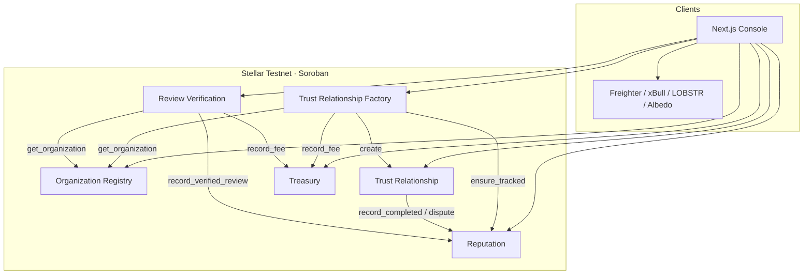
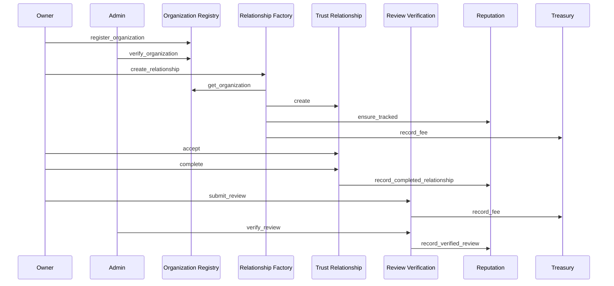
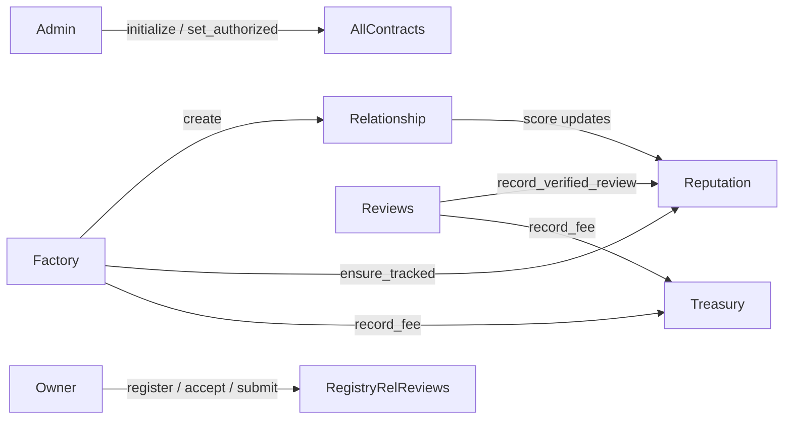

# TrustMesh

**Decentralized business trust & reputation on Stellar Soroban.**

TrustMesh is trust infrastructure for businesses, startups, agencies, freelancers, vendors, and service providers — not crowdfunding, not escrow, not NFTs, not a DAO, not CRM, and not LinkedIn.

Organizations establish **verifiable trust** through completed relationships, verified reviews, dispute history, reputation scores, and immutable on-chain records.

Built for the **Stellar Journey to Mastery — Orange Belt**.

[](https://github.com/nishant-uxs/TrustMesh/actions/workflows/ci.yml)

---

## Live demo & submission

| | Link |
|---|---|
| **GitHub repo** | https://github.com/nishant-uxs/TrustMesh |
| **Green CI/CD run** | https://github.com/nishant-uxs/TrustMesh/actions/runs/30162067608 |
| **First deploy tx (testnet)** | https://stellar.expert/explorer/testnet/tx/384cb67cad2cdcc4c27dc50bb445aed03da1c7619e0d3cec78ac78f80ba7fcd0 |
| **Sample register tx** | https://stellar.expert/explorer/testnet/tx/fa96bc2eefc492914cfd0641a667fb0df03b0be12ba3c3a97e67dcd5cd960a24 |
| **Sample verify tx** | https://stellar.expert/explorer/testnet/tx/be97ac73cf039396e1957ea0fdfa88ed328586cccc1c6ec02c985ffefc608d76 |
| **Demo video** | https://drive.google.com/file/d/1GWH_qCdsZ1c9zzUfPgUF_nY-hmoOfmzN/view?usp=sharing |
| **Live app (Vercel)** | https://trust-mesh-taupe.vercel.app/ |

Full deployment record: [`deployments/TRANSACTIONS.md`](./deployments/TRANSACTIONS.md) · env: [`deployments/testnet.env`](./deployments/testnet.env)

---

## Why it stands out

- **Six cooperating Soroban contracts** with explicit admin + authorized-caller boundaries
- **Factory orchestration** that talks to registry, relationship, reputation, and treasury in one flow
- **Reputation scoring** from completions, verified reviews, and dispute outcomes
- **Wallet picker on connect** (Freighter / xBull / LOBSTR / Albedo / Hana / Rabet)
- **Freighter-signed invokes** for register / relationships / reviews (real Testnet txs)
- **Empty-by-default console** — no seed tables, no fake balances
- **Live Testnet deployment** with contract IDs + transaction hashes
- **Event streaming** via RPC `getEvents` into a live activity timeline

---

## System architecture



### Trust lifecycle



### Authorization model



---

## Smart contracts

| Contract | ID (testnet) | Role |
|---|---|---|
| Organization Registry | [`CD6AAYZ7…NRZT`](https://stellar.expert/explorer/testnet/contract/CD6AAYZ7IVW6SQDP6NRKRZ3QIRQQPB3ZDRKTSA7ZBU2VRWN4VM4ZNRZT) | Register / verify orgs + vendors |
| Reputation | [`CDYSM4LG…RBL5`](https://stellar.expert/explorer/testnet/contract/CDYSM4LG4OUPSXGDDSJMZK7H532223GNBAF6I5RAYAFG74HD5QRPRBL5) | Trust scores from reviews & completions |
| Treasury | [`CA63C3PL…MONH`](https://stellar.expert/explorer/testnet/contract/CA63C3PLR2GQRNLES6JO72YPFO6HWUYLVWFPZBNY47BRZPYSPUGWMONH) | Fee config, deposits, fee accounting |
| Trust Relationship | [`CBCTIWGK…LDXJ`](https://stellar.expert/explorer/testnet/contract/CBCTIWGKIIGMDMJNPGT4OLVITGTVTW3JFTMHKYBOT42ENZZWEITJLDXJ) | Lifecycle, disputes, completion |
| Trust Relationship Factory | [`CBF5KOXX…JGHK`](https://stellar.expert/explorer/testnet/contract/CBF5KOXX34HEF3Q6ECLWQY543V53HJRJ25W5X3DO6O2XII4GP2FHJGHK) | Cross-contract relationship orchestration |
| Review Verification | [`CBXOCI2B…J3KF`](https://stellar.expert/explorer/testnet/contract/CBXOCI2BQTCDUJOVJCAC7TQLBA5HNGVU7UQ5JDLJF44ZHOZBG4PLJ3KF) | Submit / verify / reject reviews |

**First deploy transaction:**  
`384cb67cad2cdcc4c27dc50bb445aed03da1c7619e0d3cec78ac78f80ba7fcd0`  
Explorer: https://stellar.expert/explorer/testnet/tx/384cb67cad2cdcc4c27dc50bb445aed03da1c7619e0d3cec78ac78f80ba7fcd0

### Events emitted

`OrganizationRegistered` · `OrganizationVerified` · `RelationshipCreated` · `RelationshipCompleted` · `ReviewSubmitted` · `ReviewVerified` · `ReputationUpdated` · `TrustScoreUpdated` · `DisputeOpened` · `DisputeResolved`

---

## Repository layout

```
.
├── contracts/                 # Soroban workspace (6 crates + tests)
├── frontend/                  # Next.js 15 · TypeScript · Tailwind
├── scripts/                   # deploy.sh + deploy.ps1
├── deployments/               # Live testnet addresses + tx hashes
├── docs/                      # Architecture + demo notes
├── .github/workflows/ci.yml   # cargo test ‖ npm test/lint/build
└── README.md
```

### CI/CD pipeline

Every push / PR on `master` runs parallel jobs:

1. **Contracts** — `cargo test --workspace`
2. **Frontend** — `npm ci` → `npm test` → `npm run lint` → `npm run build`

CI: [`.github/workflows/ci.yml`](./.github/workflows/ci.yml)  
**Latest green run:** https://github.com/nishant-uxs/TrustMesh/actions/runs/30162067608

---

## Quick start

### Prerequisites

- Rust stable + wasm target (`wasm32v1-none`)
- [Stellar CLI](https://developers.stellar.org/docs/tools/cli) v25+
- Node.js 20+

### Contracts

```bash
cargo test --workspace
stellar contract build

# Windows
.\scripts\deploy.ps1 -Source deployer -Network testnet
# macOS / Linux
bash scripts/deploy.sh --source deployer --network testnet
```

### Frontend

```bash
cd frontend
cp ../deployments/testnet.env .env.local
# or: cp .env.example .env.local
npm install
npm run dev
```

Open http://localhost:3000

### Redeploy (optional)

```bash
stellar keys fund deployer --network testnet
.\scripts\deploy.ps1 -Source deployer -Network testnet
```

Then refresh `frontend/.env.local` from `deployments/testnet.env`.

---

## Frontend

Pages: Landing · Dashboard · Organizations · Relationships · Reputation · Reviews · Analytics · Activity · Public Profile · Settings

Quality bar:

- Multi-wallet connect modal
- Skeletons + empty states (no fake seed data)
- Classified wallet / RPC / contract errors
- Transaction status phases (simulate → sign → confirm)
- Live activity feed from contract events
- Settings panel with linked Testnet contract IDs
- Responsive desktop / tablet / mobile layout

---

## Testing

```bash
# 33 smart-contract tests
cargo test --workspace

# Frontend
cd frontend
npm run lint
npm test
npm run build
```

---

## Demo video

**Watch:** https://drive.google.com/file/d/1GWH_qCdsZ1c9zzUfPgUF_nY-hmoOfmzN/view?usp=sharing

Recording script: [`docs/DEMO_VIDEO.md`](./docs/DEMO_VIDEO.md)

Suggested 90s flow: landing → wallet connect → Settings (contract IDs) → register organization (sign) → Stellar Expert tx → Activity.

---

## Orange Belt checklist

Mapped requirement → implementation: [`docs/ORANGE_BELT_CHECKLIST.md`](./docs/ORANGE_BELT_CHECKLIST.md)

- [x] Advanced Soroban smart contracts
- [x] Multiple smart contracts (6)
- [x] Contract-to-contract communication
- [x] Event streaming
- [x] Production architecture
- [x] Responsive frontend + mobile
- [x] Error handling + loading states
- [x] Smart contract testing
- [x] Frontend testing
- [x] CI/CD
- [x] Deployment scripts
- [x] Production documentation
- [x] Stellar Testnet deployment

---

## Security notes

- Admin-only `initialize` / `set_authorized` / `verify_*` / dispute resolution
- Factory-only relationship creation entry (plus admin)
- Reputation + Treasury gated by authorized contract callers
- Reviewer must own the reviewer organization
- Creator must own one side of a relationship
- Self-review blocked; duplicate pair reviews blocked
- Empty-by-default UI — no fabricated balances or seed tables

---

## License

MIT
